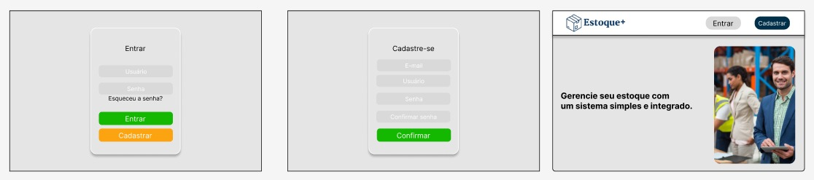

# Projeto SA
## Estoque+

O Estoque+ é um sistema de gestão de estoque desenvolvido para simplificar e otimizar o controle de mercadorias em pequenos e médios negócios. 
Com uma interface intuitiva e funcionalidades poderosas, o projeto oferece uma solução completa para registrar entradas, saídas, ajustes e 
movimentações de produtos, garantindo precisão e organização em tempo real.
O Estoque+ vai além do básico, proporcionando relatórios detalhados, alertas de reposição, rastreamento de lotes e integração com outras 
ferramentas de gestão. Seu design moderno e foco na usabilidade tornam o sistema acessível até para quem não tem experiência prévia em gestão 
de estoque.
Com o Estoque+, você ganha mais controle, reduz custos operacionais, evita desperdícios e toma decisões mais assertivas com base em dados 
confiáveis. Ideal para comércios, indústrias e prestadores de serviços que buscam eficiência e crescimento sustentável.

Estoque+: Controle simplificado, resultados ampliados.

# Integrantes

Allyson Felippo, Ian Ferreira, Lucca Alves, Wallace Nunes. (https://github.com/IanSilvaa/SotckChef)

## funcionalidades
Gestão de Produtos (Wallace)
Cadastro, edição, exclusão e listagem de produtos no estoque.
Responsável por criar a interface e lógica para gerenciar os produtos.

Controle de Estoque (Ian)
Registro de entradas e saídas de produtos, mantendo um histórico de movimentações.
Implementação de alertas para estoque baixo.

Gestão de Fornecedores (Lucca)
Cadastro, edição, exclusão e listagem de fornecedores.
Gerenciamento de informações como nome, CNPJ/CPF e contato.

Autenticação e Controle de Acesso (Allysson)
Cadastro e login de usuários.
Implementação de diferentes níveis de acesso (exemplo: administrador e usuário comum).
Garantia de que apenas usuários autorizados possam modificar ou excluir registros.

# Requisitos 
## Requisitos Funcionais

R1 - O sistema deve permitir o usuário se cadastrar no sistema;
    Descrição: O sistema deve oferecer uma funcionalidade de cadastro de usuários.
R2 - O sistema deve permitir o usuário logar no sistema;
    Descrição: O sistema deve validar o usuário logar no sistema se o mesmo se encontrar com o perfil cadastrado.
R3 - O sistema deverá exibir os produtos no estoque da empresa;
    Descrição: O sistema exibirá a listagem de produtos com opção de pesquisa e filtragem dos mesmos.
R4 - O sistema deve permitir realizar relatórios de estoque;
    Descrição: Relatórios esses para uma análise de movimentação do estoque

# Protótipo de telas de LOGIN e CADASTRO

